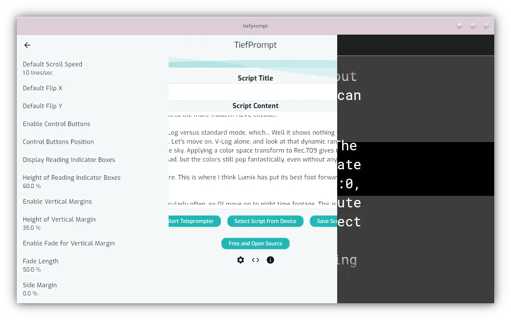

# Introduction

This documentation primarily exists for guiding you, the user, through the application and explaining features. Historically grown apps often have very complicated interfaces if they weren't designed from the beginning to be obviously accessible. So does TiefPrompt. Here, we shall strive to disentangle that.

{.w-100}

## TiefPrompts primary function

TiefPrompt is a teleprompter. Its purpose is to scroll text down a screen so you can read it while speaking.

However, the way *how* you want your text to scroll is significant. What should it look like? How should it be formatted?

TiefPrompt gives you as much freedom as possible over that. Customization is a paramount factor for TiefPrompt development and is regarded with pride.

## Overview

This Documentation is split in three parts:

- Usage --- starting with {{ autolink: '02Usage/01BasicConfig.md' }}, you can find out all off basic to advanced usage of TiefPrompt.
- Feature Description --- here, you'll find a detailed description of (almost) every feature, giving you full control over the app.
- Contributing --- if you're done finding bugs, you can proceed to contributing to the project in various ways --- find out more there.

This documentation won't be complete, as documentation goes. But it tries to be somewhat like that.
