# Setup

{{ anchor: '02Usage/01BasicConfig.md' }}

TiefPrompt is a relatively simple app designed to be usable without any setup. When first opening the app, reading the changelogs and our plea for support (which is recommended but not required, obviously), you will be greeted with the home screen. From there, you can start using the app immediately, and it will work with the default settings. However, after installing, there are some setup steps you can take to customize the app. If you want to skip the walkthrough of primary app controls, you can jump to the [Settings](#settings) section.

## Primary Controls

The app's home screen has a few primary controls you may want to familiarize yourself with. These are the buttons that allow you to start a new prompter session, open a saved session, or access the settings menu.

First, the Title text box at the top allows you to enter a script title. This is used for saving and loading scripts, and is not required to be filled in. If you do not enter a title, the app will use a default title when saving. See more under {{ autolink: '02Usage/06SavedSettings.md' }}.

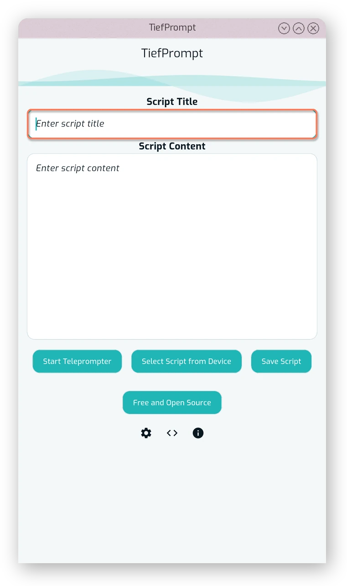{.w-50}

Below the title box is the Script content box, which is where you can enter the text you want to scroll in the prompter. This box is effectively to be filled in, and will be empty when first opening the app. You can leave it empty, however that makes for a boring prompter session.

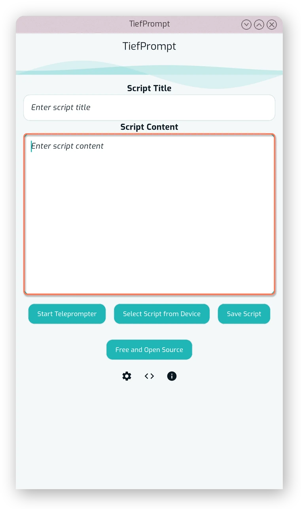{.w-50}

Then there's the primary buttons of the home screen --- the "Start Prompter" button (see {{ autolink: '02Usage/02PrompterScreen.md' }}), the "Load Saved Script" and the "Save Script" button (see {{ autolink: '02Usage/08SavedScripts.md' }}). 

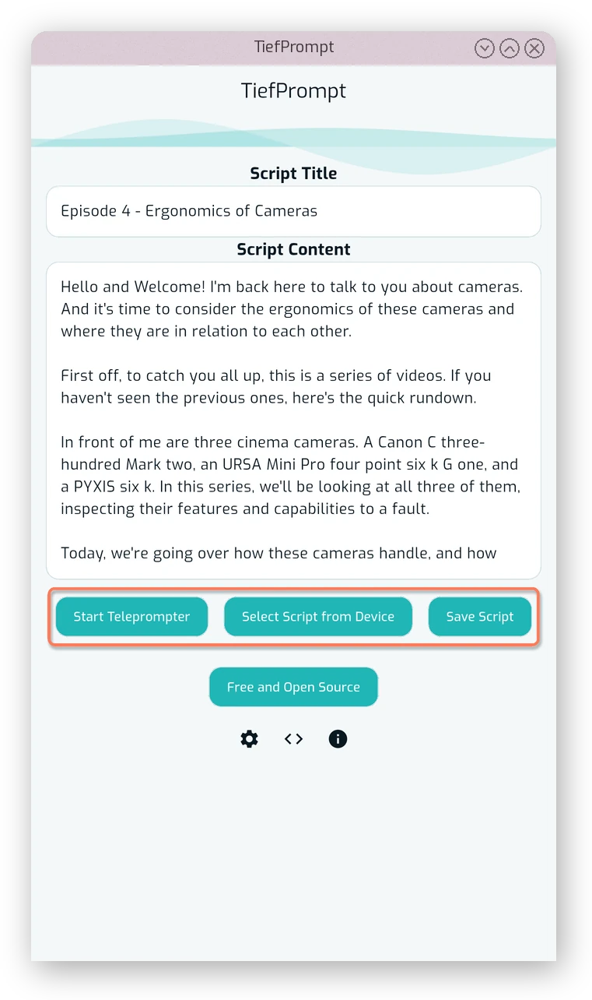{.w-50}

Below that is the button displaying the currently installed app variant. This can be clicked to get a dialog showing information about the app, and it differs between the variants ("FOSS", "Free" and "Pro"). FOSS is the "Free and Open Source Software" version, which provides all features fully for free, while the Freemium versions require an in-app purchase to unlock all features. See {{ autolink: '02Usage/07AppVariants.md' }} for more information.

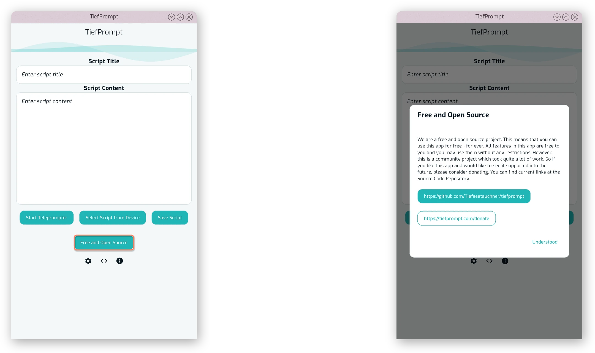{.w-100}

## Settings

To access the settings, click the cogwheel below the primary app buttons as shown below.

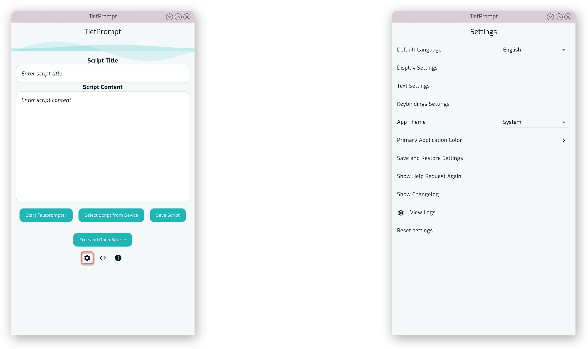{.w-100}

## Language

The primary language TiefPrompt is developed in is English. However, there are other languages available. Among them are:

- German
- Russian
- Simplified Chinese
- Pirate English

After opening the app, you can navigate to the settings menu via the cogwheel below the primary app buttons as shown below, and select the language from the top of the menu.

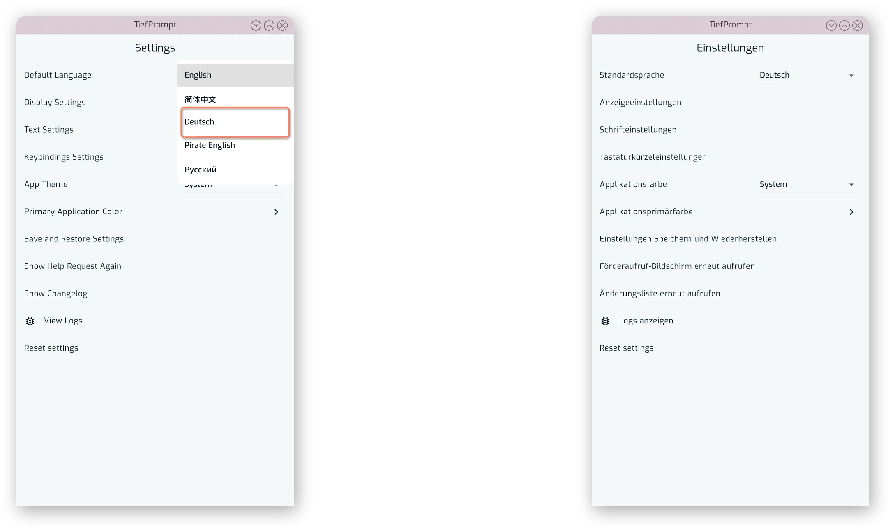{.w-100}

## Theming

The apps theme is similarly configurable, this time to either be light, dark or system dependent.

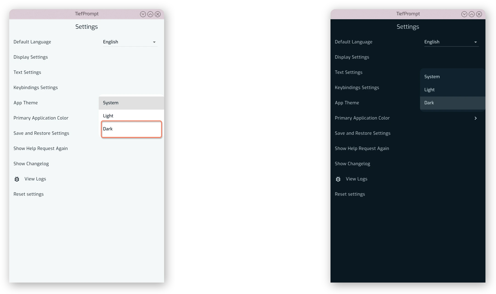{.w-100}

In addition to the theme, there is also a primary color switch that allows you to stylize TiefPrompt's primary color. This affects buttons and the general theme of the app.

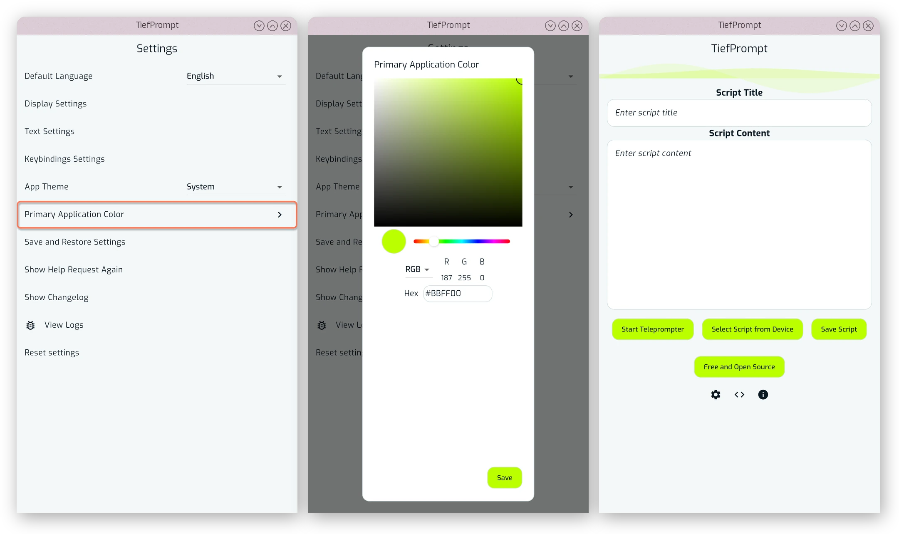{.w-100}

This primary color change does not however affect the prompter directly; those are separate, different settings.

## Prompter Screen

Being the most prominent screen of the application, the actual scrolling text screen deserves its own part at {{ autolink: '02Usage/02PrompterScreen.md' }}. But below is a sneak peek of what could be your prompter screen after configuring it.

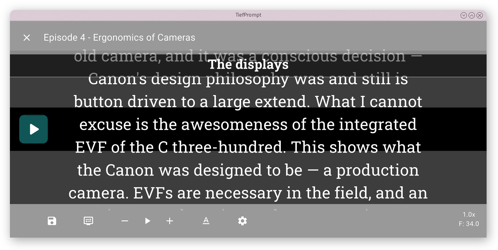{.w-100}

## Display and Text Settings

The two largest articles of the settings screen are the Display Settings and Text Settings screens. Both are too in depth for this part, but are explained further in {{ autolink: '02Usage/03DisplaySettings.md' }} and {{ autolink: '02Usage/04TextSettings.md' }} respectively. These two screens adjust the look and feel of the Teleprompter.

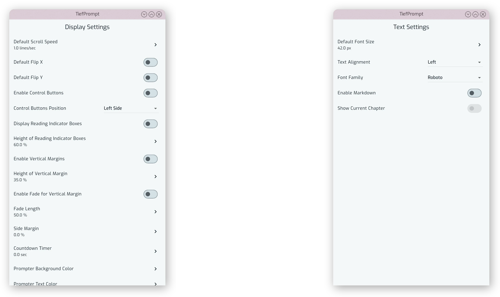{.w-100}

## Saving and Restoring your Settings

You can also save and restore settings using the Save Settings Profile feature.

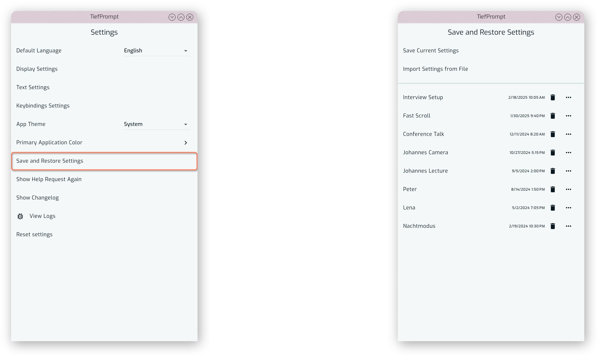{.w-100}

See {{ autolink: '02Usage/06SavedSettings.md' }} for more information.

## Keybinding Settings

TiefPrompt allows for customization of Keyboard and Controller controls in the app. To adjust the keybindings, access the Keybindings Settings under the settings screen.

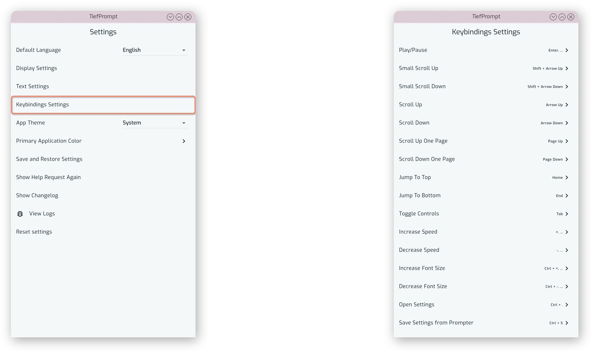{.w-100}

See {{ autolink: '02Usage/05Keybindings.md' }} for more information.

