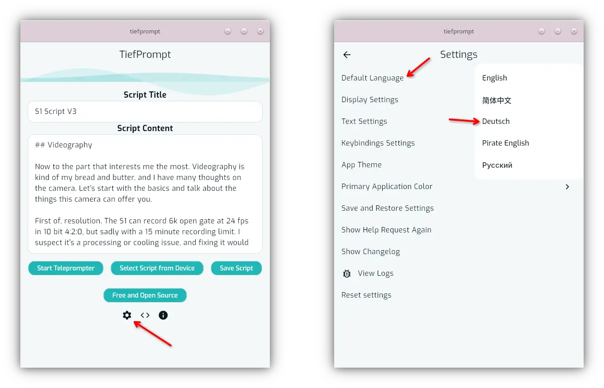
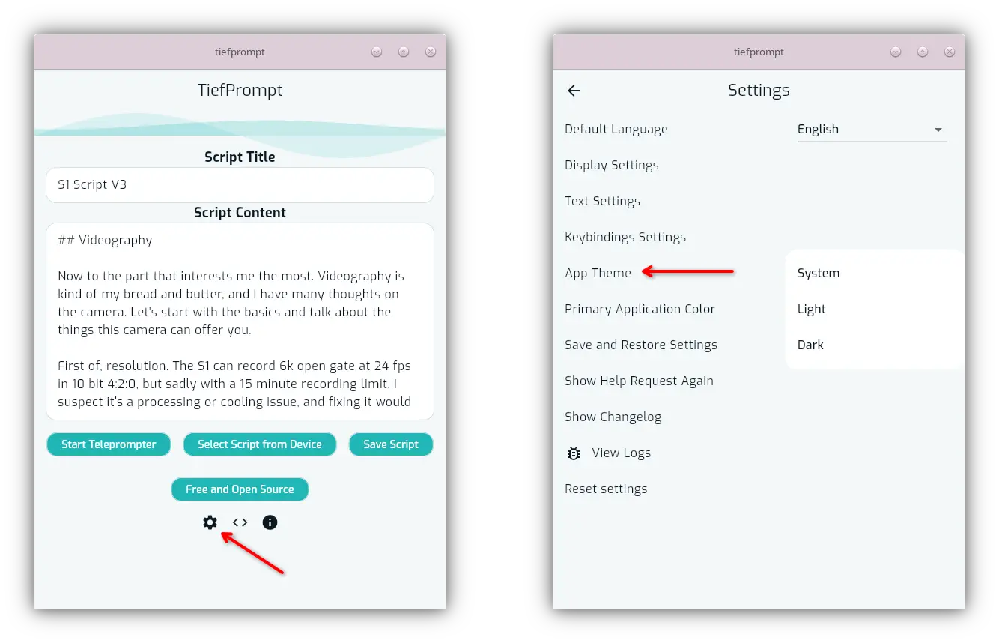
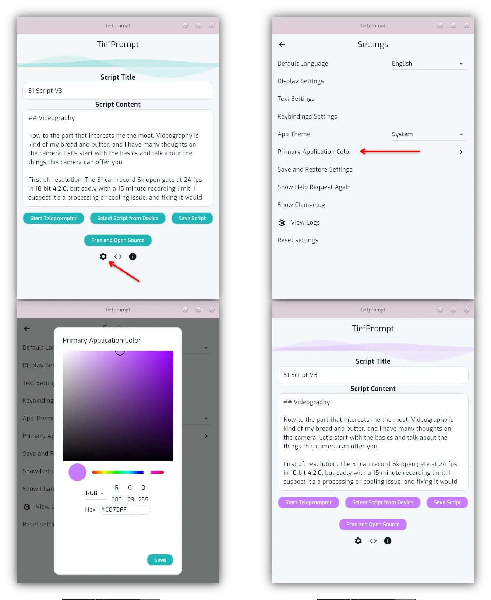
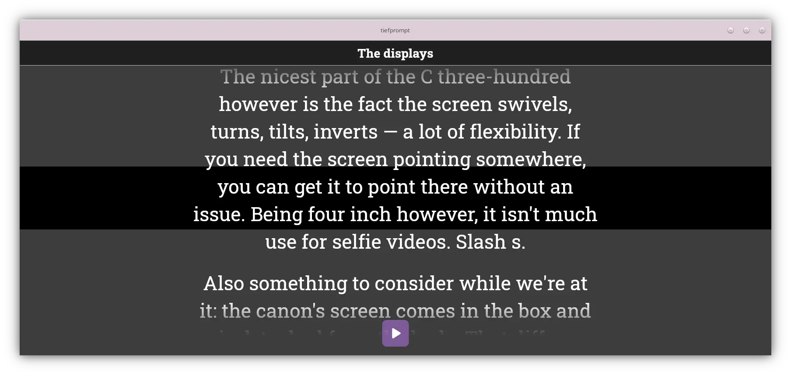
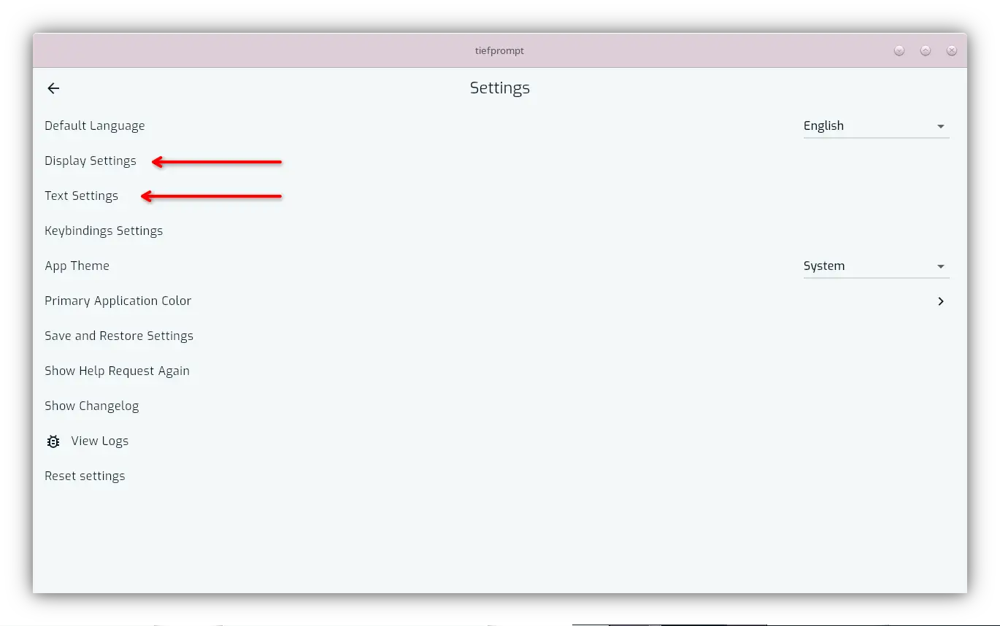
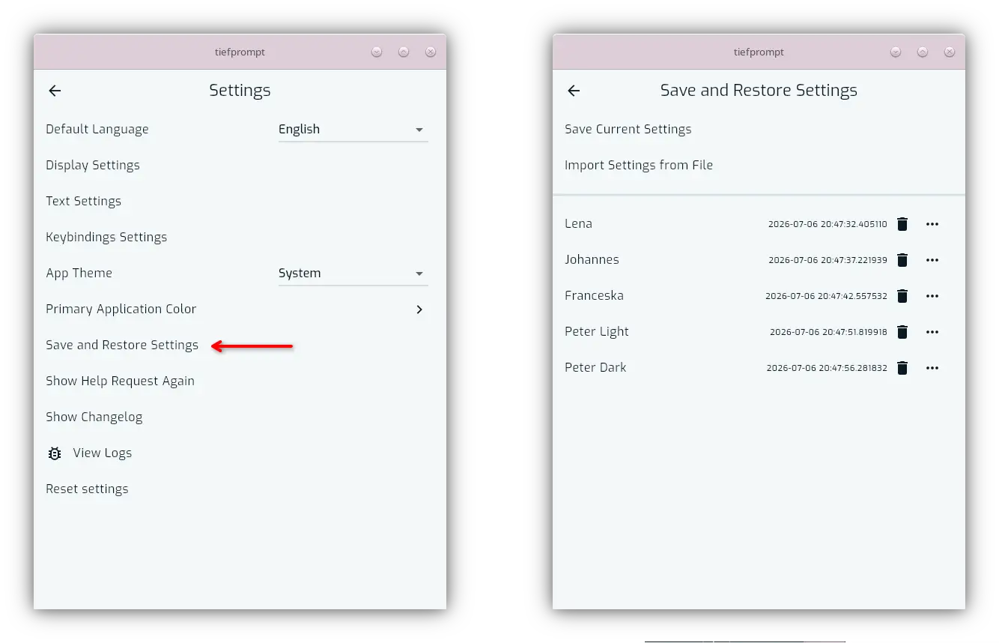
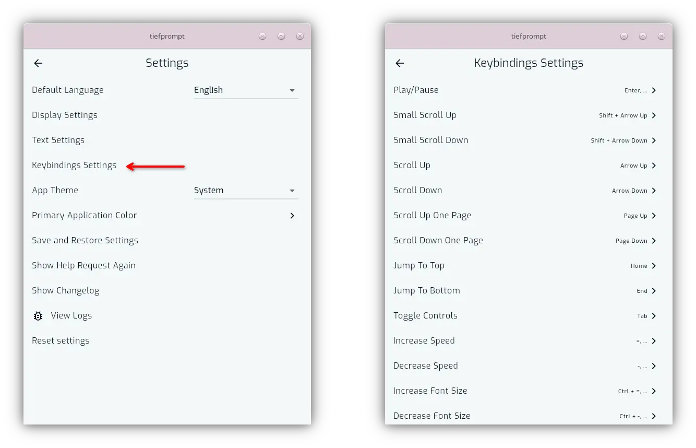

# Setup

{{ anchor: '02Usage/01BasicConfig.md' }}

TiefPrompt is a relatively simple app designed to be usable without any setup. However, after installing, there are some setup steps you can take to customize the app. If you'd like to skip them, jump to {{ autolink: '02Usage/02PrompterScreen.md' }}.  

## Language

The primary language TiefPrompt is developed in is English. However, there are other languages available. Among them are:

- German
- Russian
- Simplified Chinese
- Pirate English

After opening the app, you can navigate to the settings menu via the cogwheel below the primary app buttons as shown below, and select the language from the top of the menu.

{.w-100}

## Theming

The apps theme is similarly configurable, this time to either be light, dark or system dependent.

{.w-100}

In addition to the theme, there is also a primary color switch that allows you to stylize TiefPrompt's primary color. This affects buttons and the general theme of the app.

{.w-100}

This primary color change does not however affect the prompter directly; those are separate, different settings.

## Prompter Screen

Being the most prominent screen of the application, the actual scrolling text screen deserves its own part at {{ autolink '02Usage/02PrompterScreen.md' }}. But below is a sneak peek of what could be your prompter screen after configuring it.

{.w-100}

## Display and Text Settings

The two largest articles of the settings screen are the Display Settings and Text Settings screens. Both are too in depth for this part, but are explained further in {{ autolink: '02Usage/03DisplaySettings.md' }} and {{ autolink: '02Usage/04TextSettings.md' }} respectively. These two screens adjust the look and feel of the Teleprompter.

{.w-100}

## Saving and Restoring your Settings

You can also save and restore settings using the Save Settings Proile feature.

{.w-100}

See {{ autolink: '02Usage/06SavedSettings.md' }} for more information.

## Keybinding Settings

TiefPrompt allows for customization of Keyboard and Controller controls in the app. To adjust the keybindings, access the Keybindings Settings under the settings screen.

{.w-100}

See {{ autolink: '02Usage/05Keybindings.md' }} for more information.

