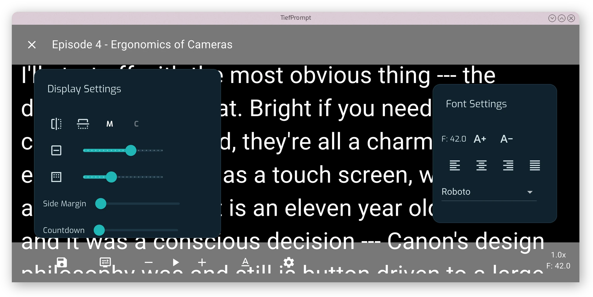

# The Prompter Screen

{{ anchor: '02Usage/02PrompterScreen.md' }}

The Prompter Screen shows the scrolling text. How that text looks and moves is governed by the settings covered in {{ autolink: '02Usage/03DisplaySettings.md' }} and {{ autolink: '02Usage/04TextSettings.md' }}, but the top bar, bottom bar and their controls stay the same regardless of configuration.

{.w-100}

## Top Bar

The top bar shows an X button to leave the Prompter Screen and return to script selection, along with the title of the script currently loaded.

## Bottom Bar

The bottom bar holds icons on the left and two readouts on the right.

From left to right, the icons are: Save Prompter Settings, Display Settings overlay toggle, Reduce Speed, Play/Pause, Increase Speed, Text Settings overlay toggle, and Enter Settings.

Save Prompter Settings takes the ephemeral adjustments made through the two overlays below and writes them to the permanent settings. Enter Settings leaves the Prompter Screen for the full settings menu.

The right side shows the current scroll speed in lines per second, and below that, the current font size.

To show/hide the bottom or top bar, tap the screen anywhere outside of the text area.

## Display and Text Overlays

The Display Settings and Text Settings icons each toggle an overlay on top of the scrolling text. Both overlays can be open at the same time, and changes apply immediately. Nothing is written to the permanent settings until Save Prompter Settings is pressed.

{.w-100}

Each control in these overlays is covered in {{ autolink: '02Usage/03DisplaySettings.md' }} and {{ autolink: '02Usage/04TextSettings.md' }}.
