# Display Settings

{{ anchor: '02Usage/03DisplaySettings.md' }}

The Display Settings screen, reachable from the main settings menu, holds the defaults applied whenever a script is opened in the Prompter Screen. The overlay described in {{ autolink: '02Usage/02PrompterScreen.md' }} lets you change the same values temporarily during a session; pressing Save Prompter Settings there writes them back to these defaults.

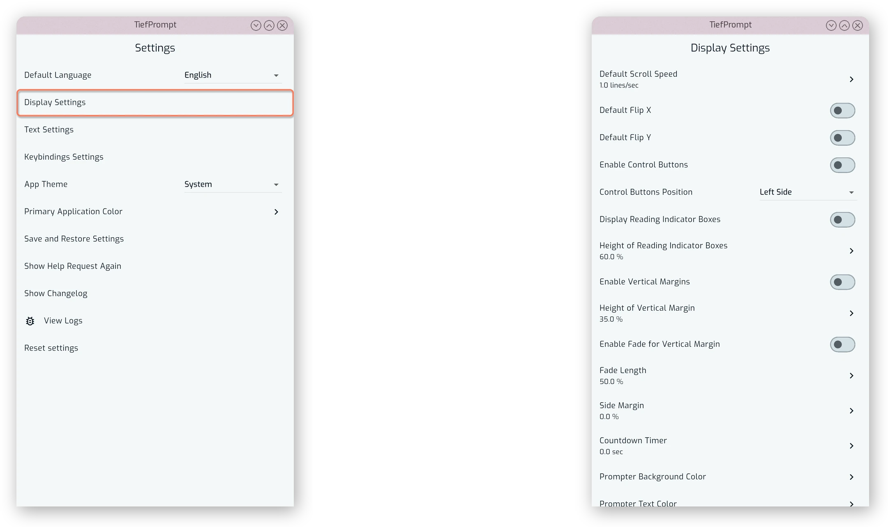{.w-100}

## Scrolling and Flipping

Default Scroll Speed sets the speed the text scrolls at when a script is opened, in lines per second.

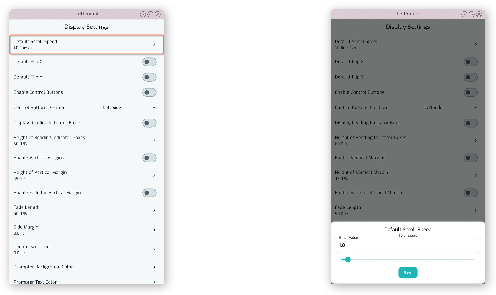{.w-100}

Default Flip X and Default Flip Y mirror the text horizontally or vertically. This is intended for use with a teleprompter rig, where the text is reflected off a piece of glass and needs to be flipped to read correctly.

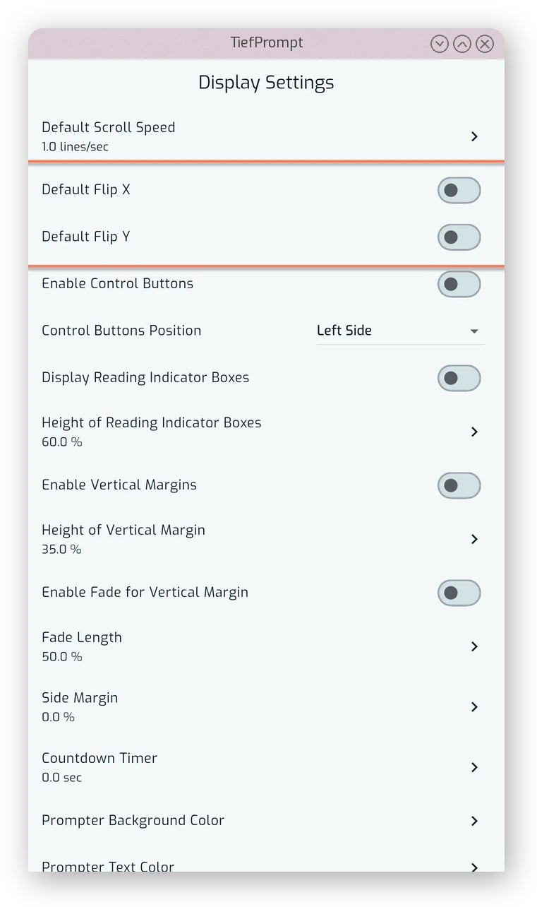{.w-50}

## Control Buttons

Enable Control Buttons shows or hides the on-screen playback controls over the prompter text. These are separate from the controls in the bottom bar, and can be positioned on any side of the screen.

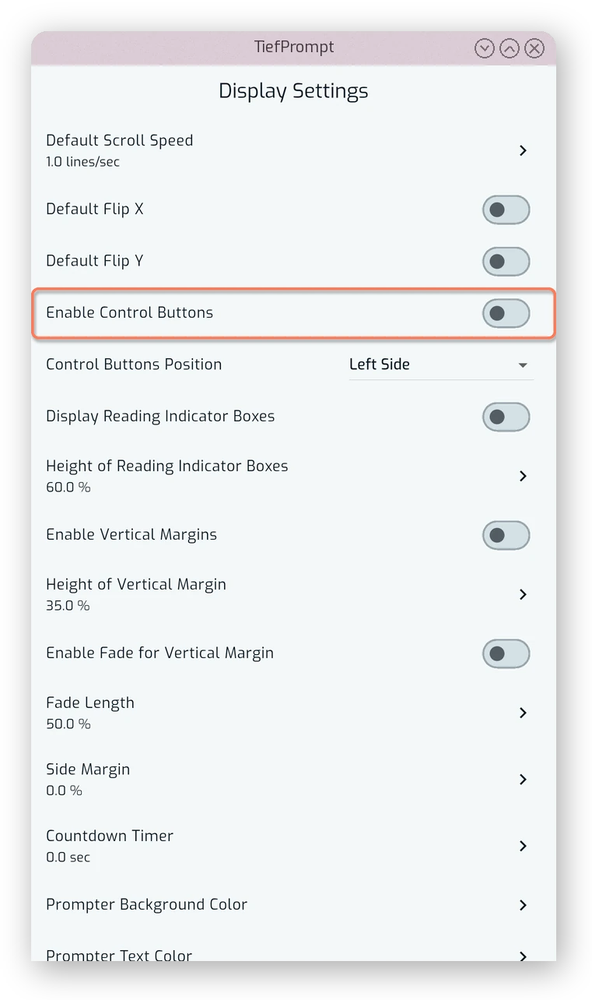{.w-50}

Control Buttons Position selects which side of the screen they're anchored to: left, right, top or bottom.

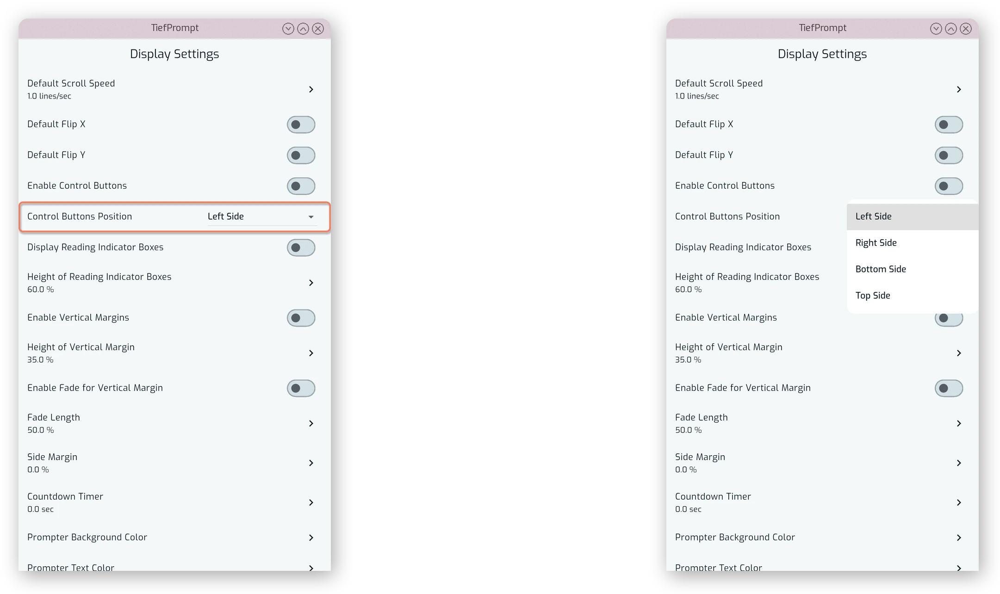{.w-100}

## Reading Indicators

Display Reading Indicator Boxes draws two boxes across the width of the screen marking the area you should be reading from.

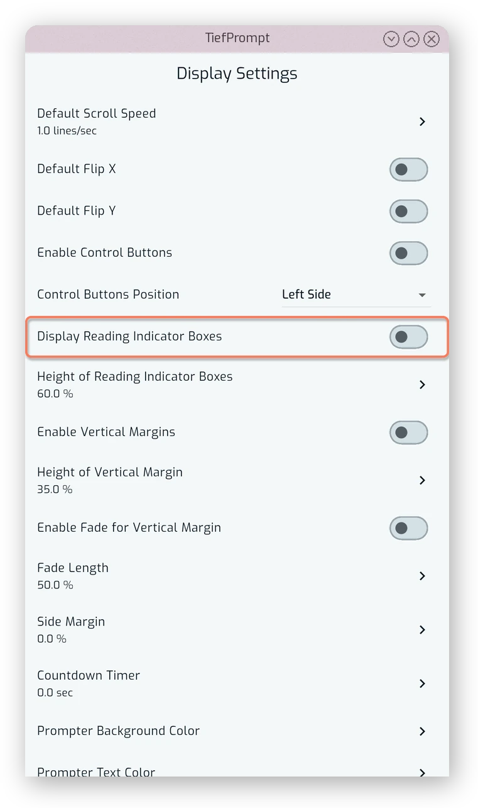{.w-50}

Height of Reading Indicator Boxes sets how tall those boxes are, as a percentage of the screen.

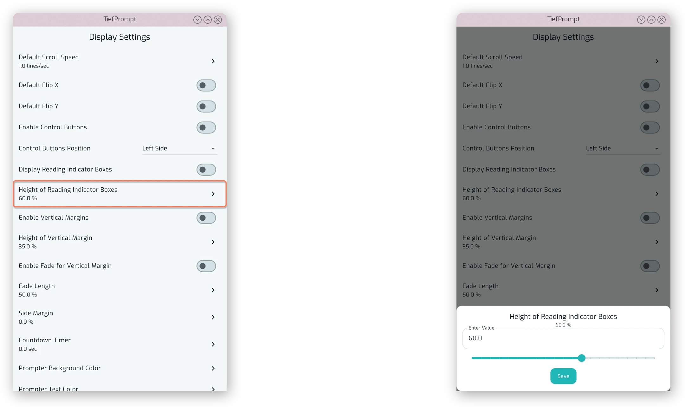{.w-100}

## Vertical Margins

Enable Vertical Margins reserves a band of empty space at the top and bottom of the screen so text doesn't scroll all the way to the edges.

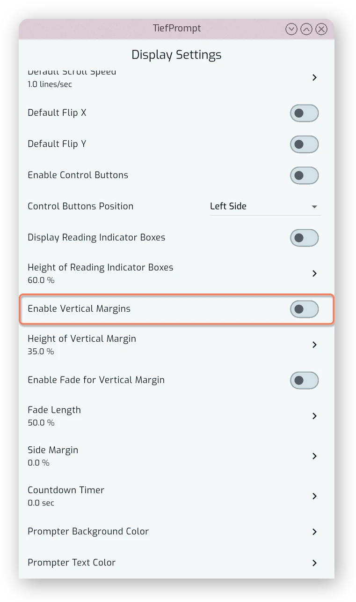{.w-50}

Height of Vertical Margins sets how large that band is.

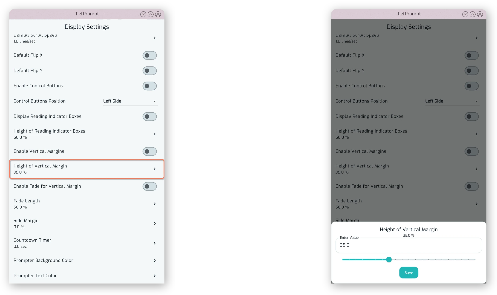{.w-100}

Enable Fade for Vertical Margin fades the text into the background near the edge of the margin rather than cutting it off sharply.

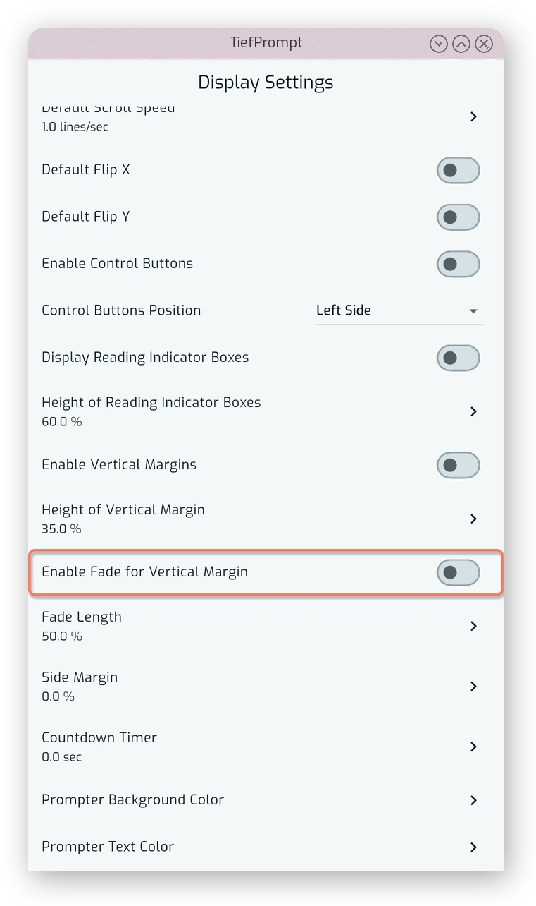{.w-50}

Fade Length controls how far that fade extends.

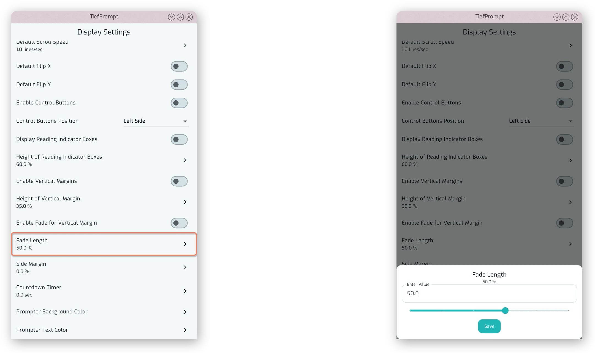{.w-100}

## Side Margin and Countdown

Side Margin adds empty space on the left and right of the text, as a percentage of the screen width.

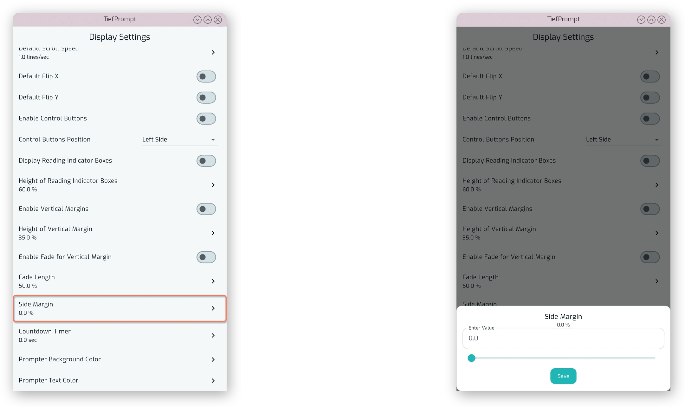{.w-100}

Countdown Timer sets how many seconds pass between pressing play and the text starting to scroll.

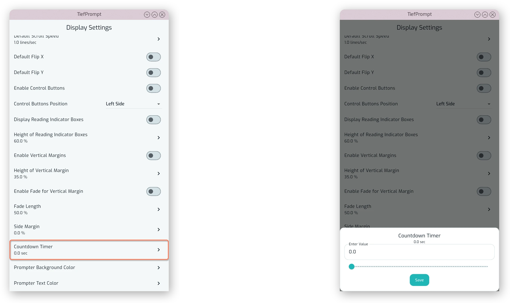{.w-100}

## Colors

Prompter Background Color sets the color used behind the scrolling text, independently of the app's own theme and primary color.

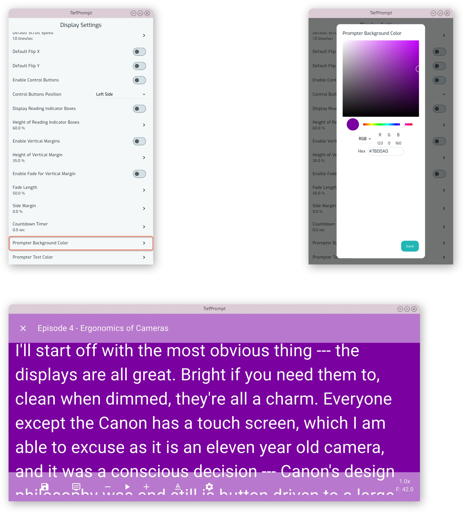{.w-100}

Prompter Text Color sets the color of the scrolling text and the affordances of the app themselves.

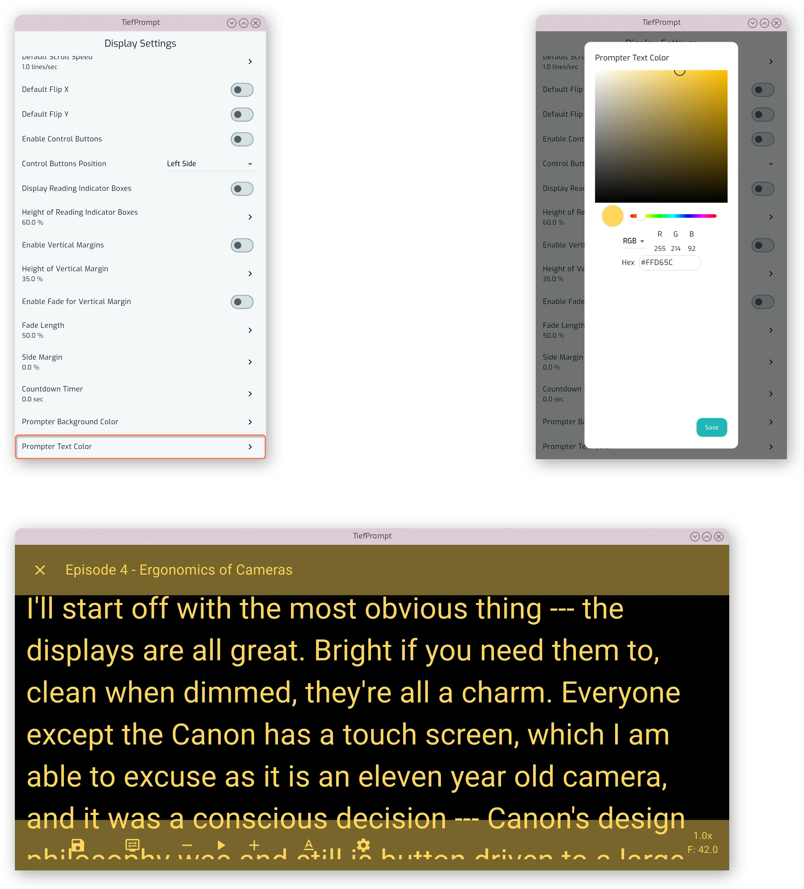{.w-100}
