# Text Settings

{{ anchor: '02Usage/04TextSettings.md' }}

The Text Settings screen is the primary entrypoint for changing how the text looks in the prompter. The default settings are opinionated --- but every setting is configurable.

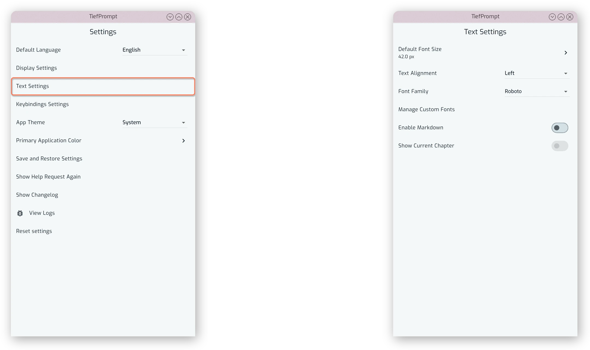{.w-100}

## Text Display Settings

In the Text Settings screen, the text size can be adjusted with a slider by pressing the "Default Font Size" entry:

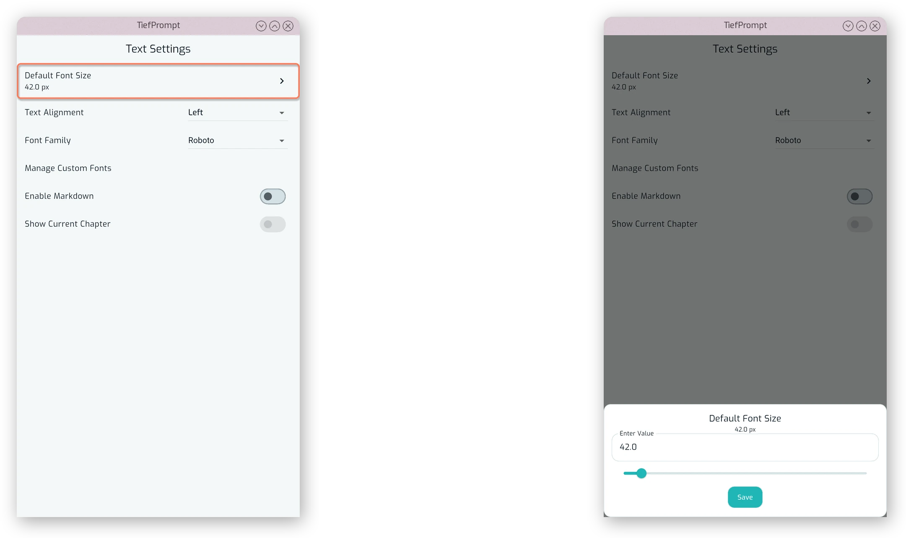{.w-100}

The alignment of the text can also be changed via a dropdown. Available settings are left, centered, right, and justified. The default is left.

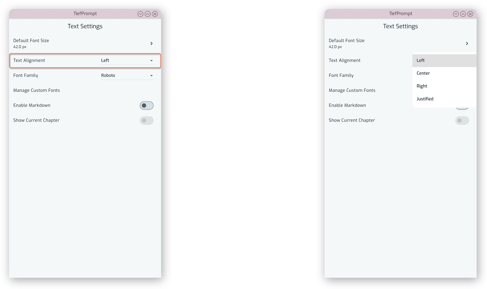{.w-100}

## Font Settings

The font used in the scrolling text and markdown chapter headings (see {{ autolink: '02Usage/04TextSettings.md#current-chapter-display'}}) can be changed via the "Font Family" dropdown. The default is "Roboto".

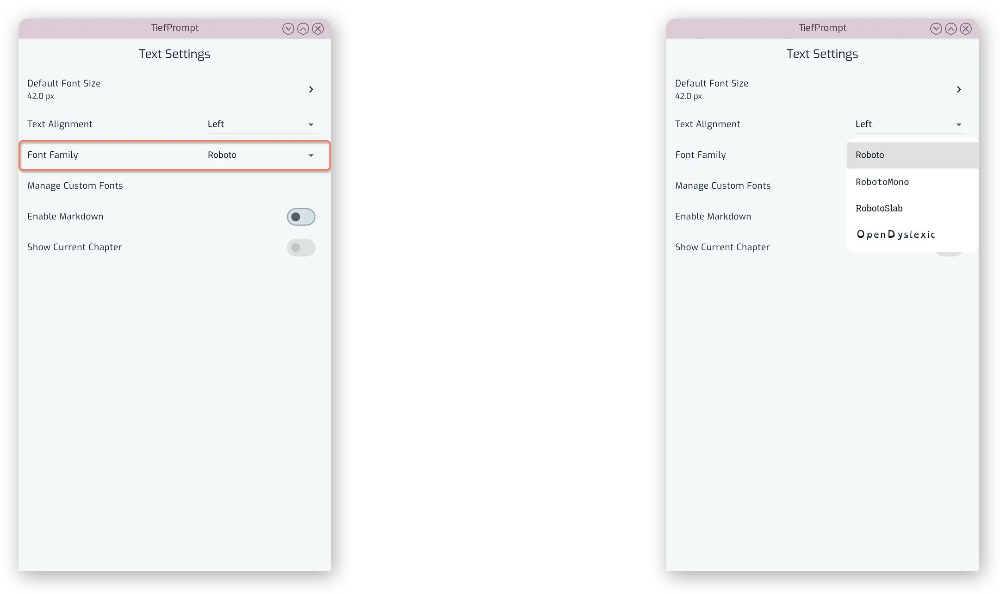{.w-100}

## Custom Fonts

There is also a posibility to add a custom font to the app. This is done by pressing the "Manage Custom Fonts" entry to get to the settings page, which shows a list of currently installed fonts, as well as the preinstalled fonts, and allows for adding or removing fonts via a file selector. The font file must be in TTF or OTF format, and will be copied to the app's database. You need not keep the font file around after adding it to the app.

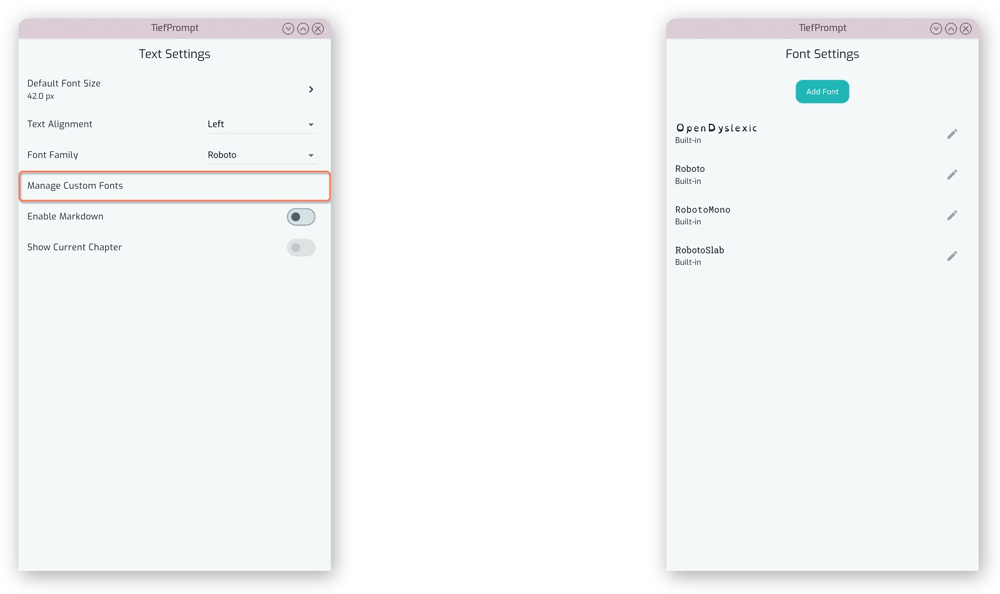{.w-100}

Each font can have multiple versions --- if you, say, have a font with a regular, a bold, a italics and a bold-italics version as separate files, you can add them all to the app. After adding a font family, you are able to rename it by pressing the edit icon next to it. This will open a dialog where you can enter the new name. This is useful if the app does not detect the font family correctly, or if you want to change the name of a font family.

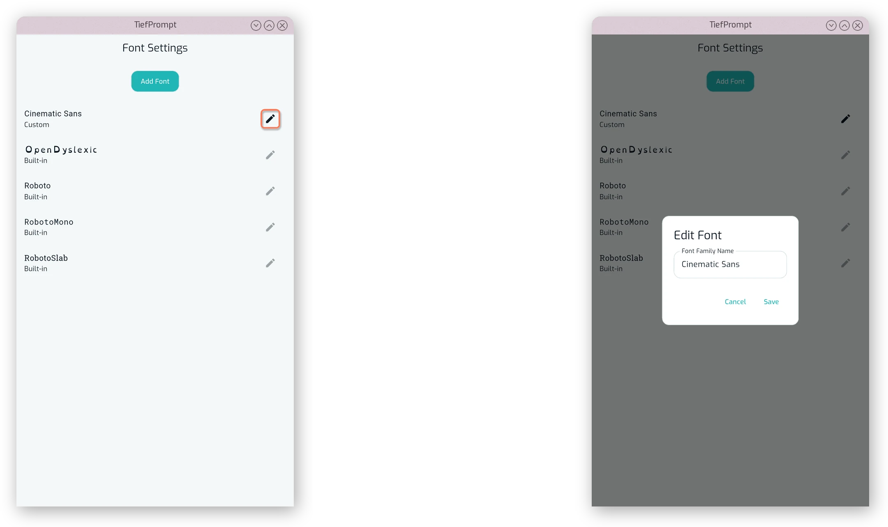{.w-100}

If the font name integrated in the files matches (not the file name!), the app will automatically detect the different versions and use them accordingly. If your fonts do not have matching names, you can manually move the font variant by clicking on a font family and pressing the move icon next to the variant. This will open a dialog where you can select the font family to move the variant to. Integrated fonts cannot be added to or moved.

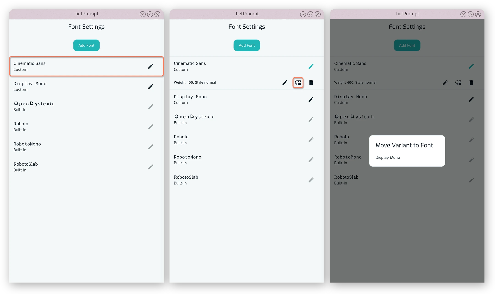{.w-100}

You can also remove a font variant by pressing the trashcan icon next to it. This will remove the font from the app's database, but will not delete the original file.

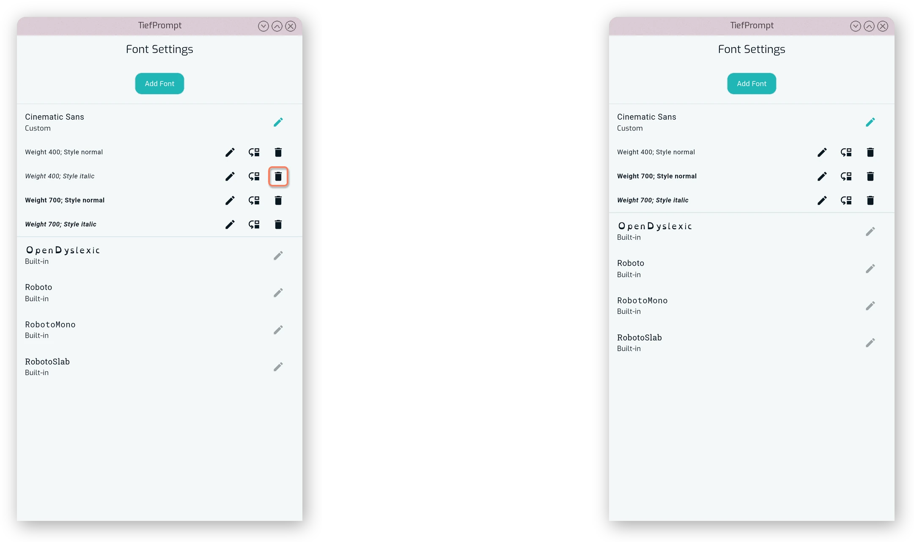{.w-100}

When deleting the last variant of a font family, the font family will also be removed from the app's database.

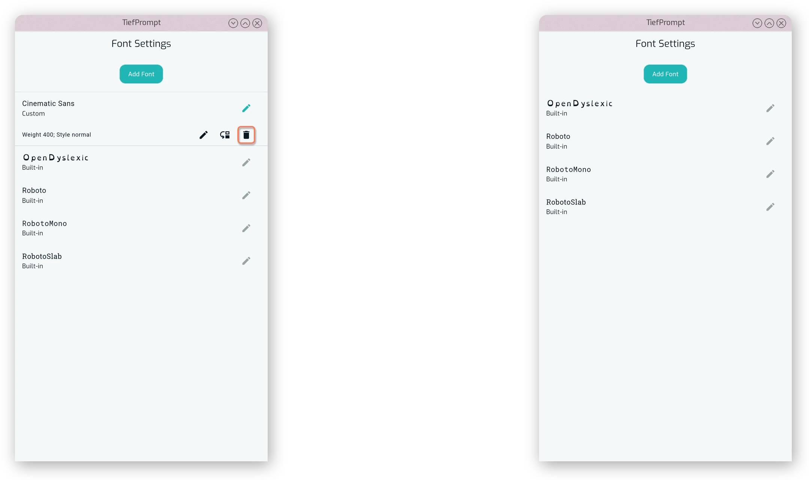{.w-100}

Lastly, by pressing the edit icon next to a font variant, you can edit the variant's weight and whether it is an italic font or not. This is useful if the app does not detect the variant correctly, or if you want to change the weight of a font variant.

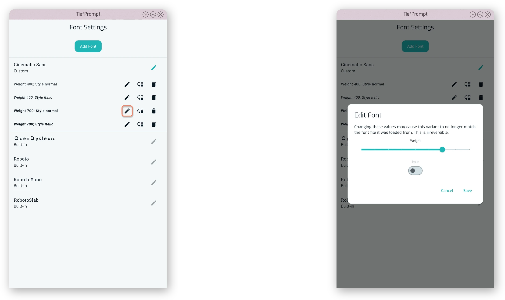{.w-100}

## Markdown

Markdown rendering can be enabled via the "Enable Markdown" toggle. This will render the text in the prompter as Markdown, allowing for formatting such as bold, italics, headings, and more. The default is off.

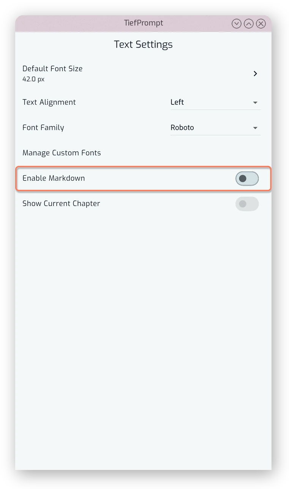{.w-50}

This is not a full Markdown renderer, but it does support the most common formatting options. For more information on what is supported, see {{ autolink: '04Contributing/03Markdown.md' }}.

## Current Chapter Display

The toggle "Show Current Chapter" controls whether the current chapter is displayed in the prompter. This can only be enabled if Markdown is enabled. The default is off.

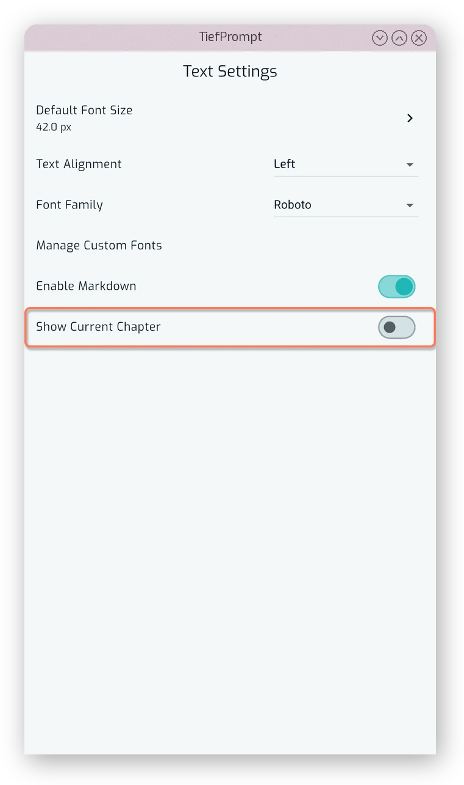{.w-50}

When the current chapter is displayed, it will be shown in a separate line above the scrolling text, and will be updated as the text scrolls. The chapter is determined by the first heading in the Markdown text that has been scrolled by in the prompter.

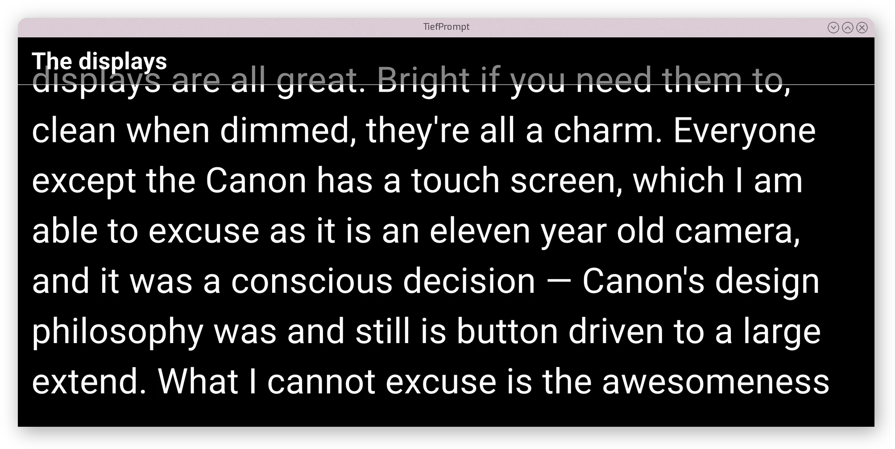{.w-100}
