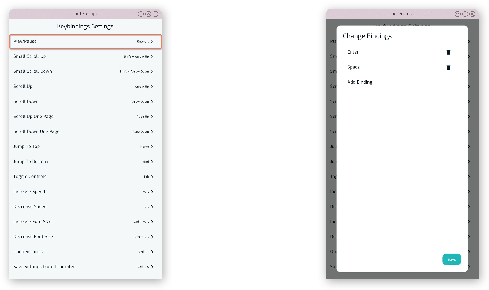
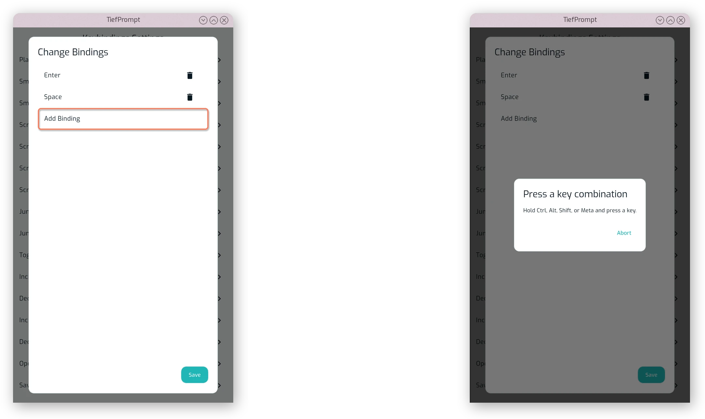
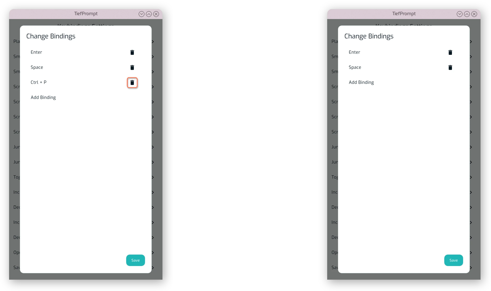

# Keybindings

{{ anchor: '02Usage/05Keybindings.md' }}

The keybindings screen is the primary entrypoint for changing how to control the prompter. The default controls are opinionated --- but every keybinding is configurable.

Keybinding configuration is primarily for keyboards and controllers. Mouse buttons are not configurable, and the mouse wheel is always used for scrolling. Each binding (an action in the prompter) can have an arbitrary amount of keyboard shortcuts and controller buttons assigned to it, and a shortcut can be assigned to multiple actions.

::: callout-warn
As per current version v1.1.0+, there is a bug where only the **first listed action** for a keybinding is actually used. This means that if you assign the same key to multiple actions, only the first one will be triggered. This will be fixed in a future release.
:::

## Changing Keybindings

The Keybindings can be changed in the Keybindings Settings screen, which is accessible from the settings menu. Each action has a list of currently assigned shortcuts, and can be asigned a new one or have an old one removed by pressing the keybinding in the list. This will open a dialog as shown below.

{.w-100}

A new keybinding can be assigned by pressing the "Add Binding" button, which opens another dialog where you can press the desired key or controller button.

{.w-100}

A keybinding can be removed by pressing the trashcan icon next to it in the list of currently assigned bindings. This will remove the binding immediately, with no confirmation dialog.

{.w-100}