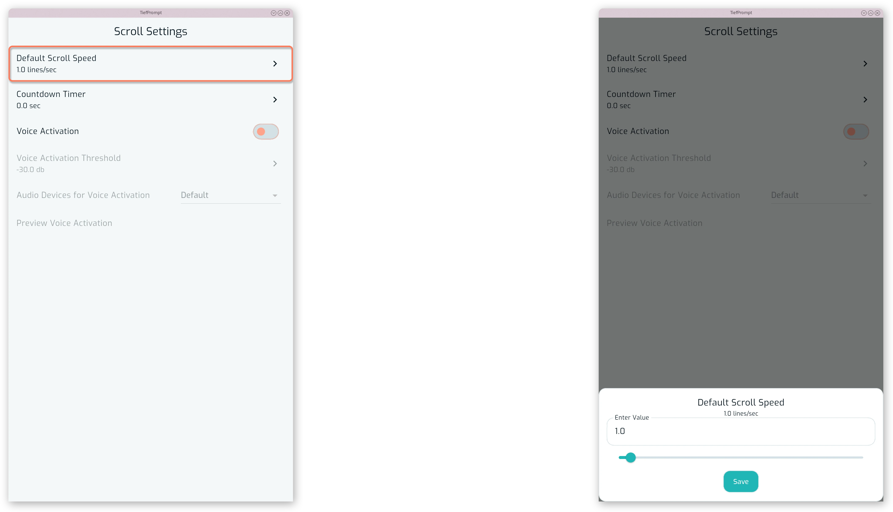
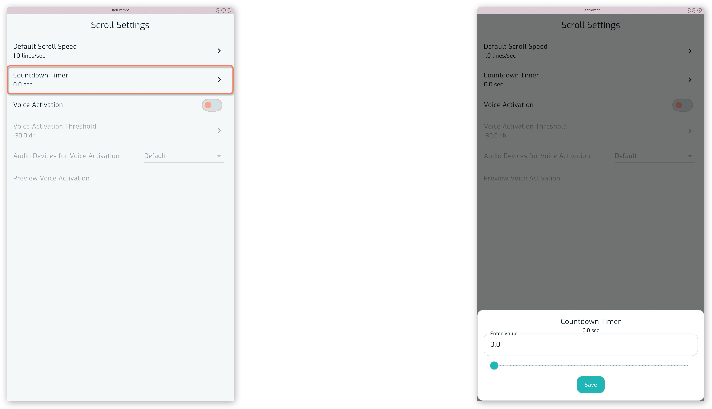
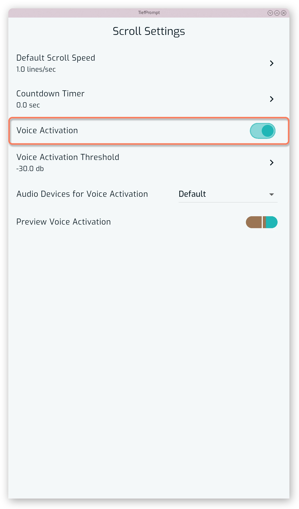
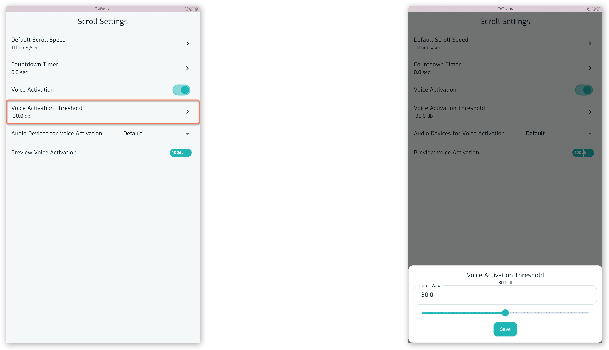
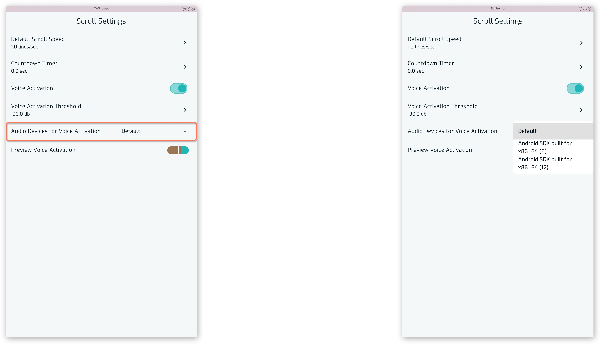
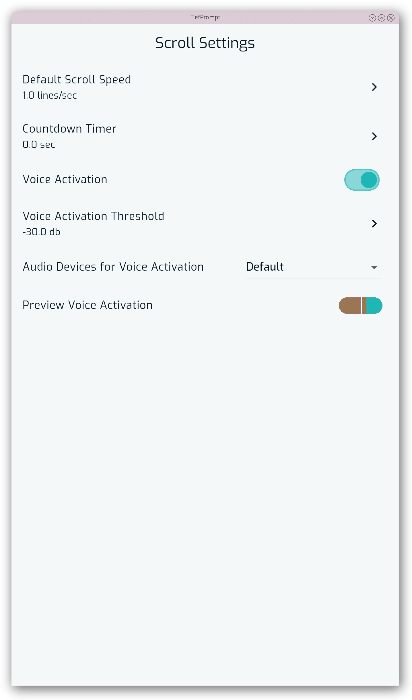

# Scroll Settings

{{ anchor: '02Usage/05ScrollSettings.md' }}

The Scroll Settings screen is the configuration section for scrolling and related settings.

## Scroll Speed

Default Scroll Speed sets the speed the text scrolls at when a script is opened, in lines per second.

{.w-100}

## Countdown Timer

Countdown Timer sets how many seconds pass between pressing play and the text starting to scroll.

{.w-100}

## Voice Activation

Voice Activation allows users to control the teleprompter with their voice. You can enable voice activation and test it on the Scroll Settings screen.

{.w-33}

When voice activation is enabled, the prompter only scrolls when it detects sound above the configured threshold.

You can adjust the sensitivity of the voice activation to ensure it responds appropriately to your voice.

{.w-100}

The audio device used can be selected from the dropdown menu.

{.w-100}

You may test the voice activation by enabling the Preview Voice Activation option.

{.w-100}

Learn more at {{ autolink: '03Features/07VoiceActivation.md' }}.