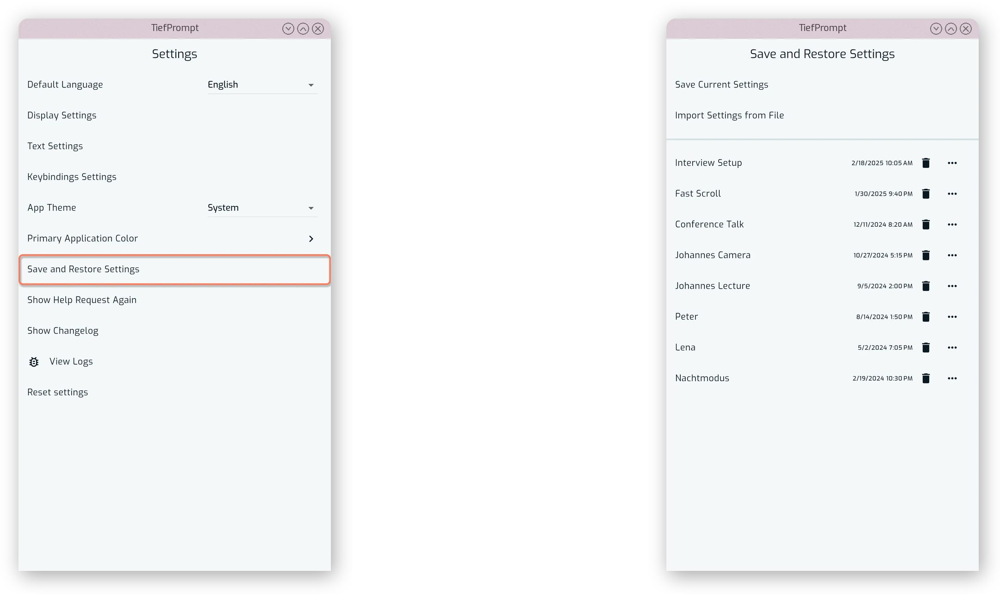
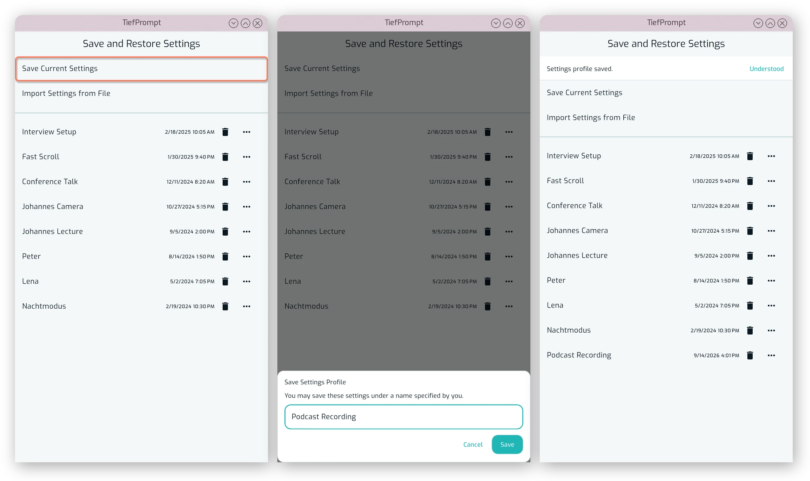
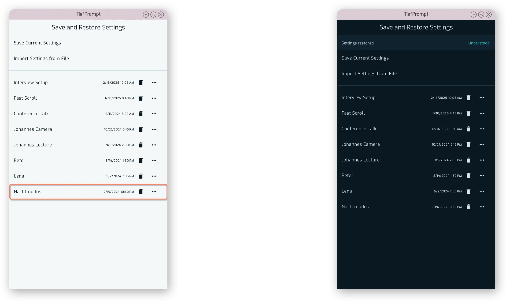
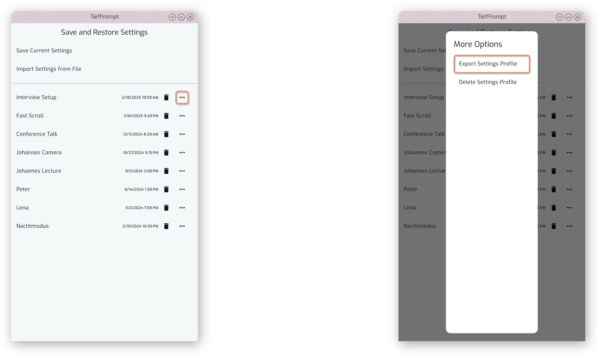
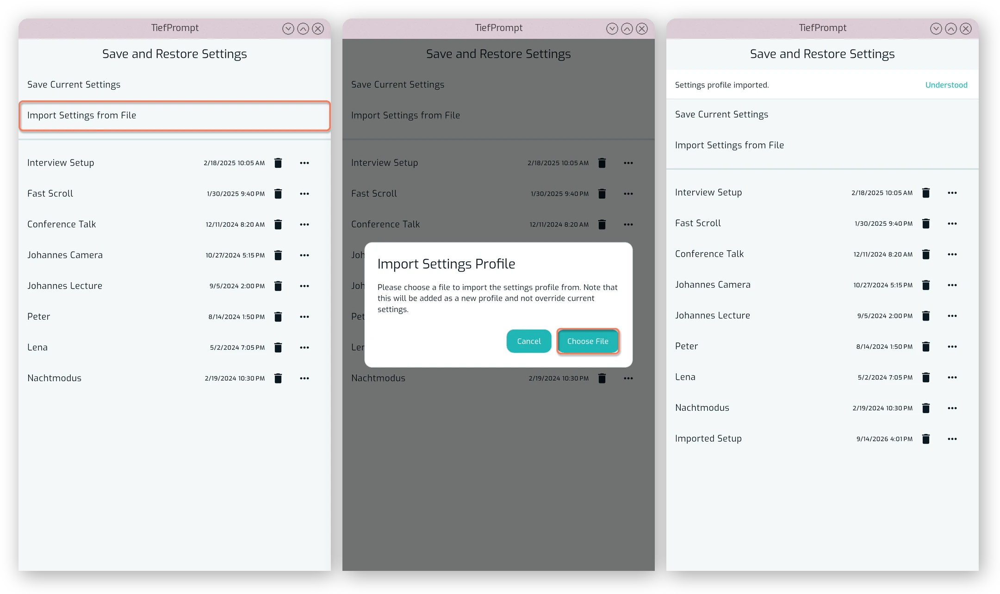
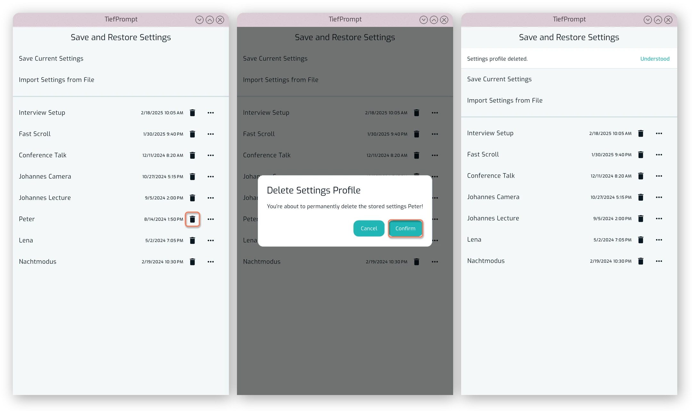

# Save and Restore Settings

{{ anchor: '02Usage/06SavedSettings.md' }}

As customization is an integral part of TiefPrompt, and we're aware of multiple-user workflows, there is the option to save and restore settings. That is positioned right below the primary color control, giving access to a list of named, saved settings as well as the option to import or export settings files.

{.w-100}

To save settings, press the button labeled "Save Current Settings" and enter a name. The new setting appears in the list below, and you can apply it by pressing on it.

{.w-100}

When applying settings, the whole app will be updated. Any currently unsaved changes will be lost, so make sure to save your current settings before applying a new one.

{.w-100}

Once saved, you can also export or delete a settings profile by pressing the three buttons to the right of each profile:

{.w-100}

After entering the file name and location of your settings profile, you are able to copy it to a different device and import it from the same screen:

{.w-100}

To delete a profile, press the trashcan icon next to it and confirm.

{.w-100}
