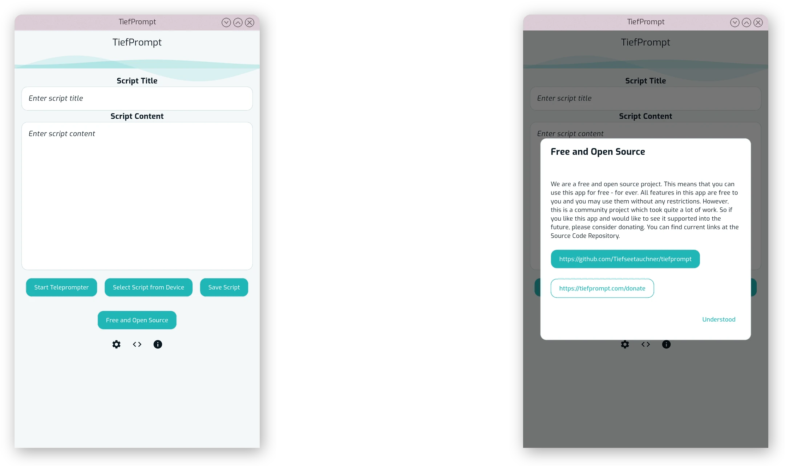
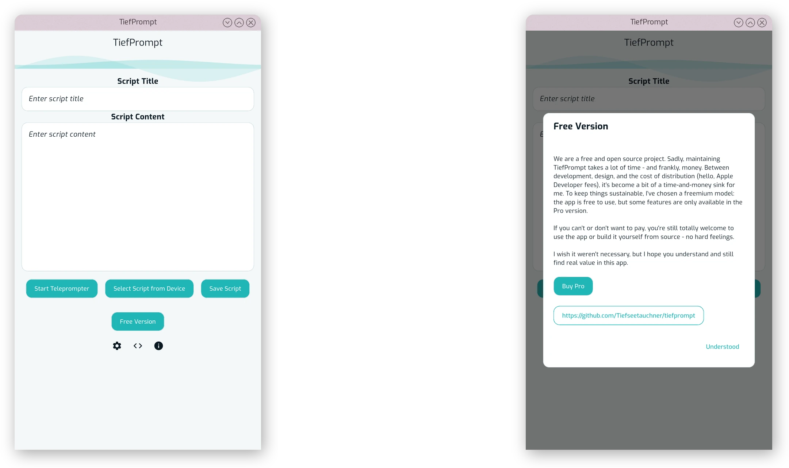
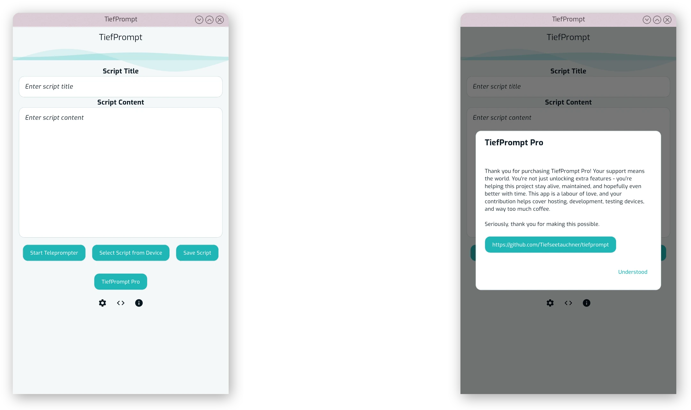
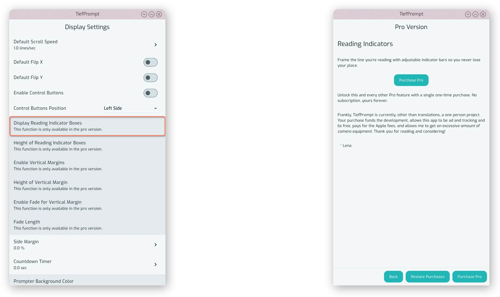

# App Variants

{{ anchor: '02Usage/07AppVariants.md' }}

TiefPrompt is available in multiple variants, each with its own set of features and capabilities. The main variants are:

- FOSS: The "Free and Open Source Software" version, which provides all features fully for free. This version is available on GitHub and F-Droid.
- Free: The freemium version available on the App Store, which has some features locked behind an in-app purchase.
- Pro: The freemium version available on the App Store, which has all features unlocked after an in-app purchase.

The core functionality of TiefPrompt is the same across all variants, but the availability of certain features may differ. The FOSS version is fully open-source and free to use, while the Free and Pro versions may require payment for access to certain features.

No proprietary dependencies are leaked into the FOSS version. The FOSS version is fully separated from in-app purchase logic and does not transmit any data to third-party services. The Free and Pro versions, however, include proprietary dependencies and in-app purchase logic. Read our [privacy policy](https://tiefprompt.com/policies/privacy/en) for more information on data collection and usage.

Currently, the app variant can be viewed in the home screen, below the primary buttons. Clicking on it will show a dialog with information about the installed variant.

{.w-100}

{.w-100}

{.w-100}

## Gated features

Currently, the following features are gated behind an in-app purchase in the Freemium variant.

- Reading Indicator Boxes
- Vertical Margins
- Custom Prompter Colors
- Keybindings
- Markdown support and Current Chapter Display
- Saving and Restoring of Settings

When a feature is gated, it will be shown in the menu and prompter as locked. Pressing on it will show a dialog where you can purchase the Pro version to unlock it.

{.w-100}