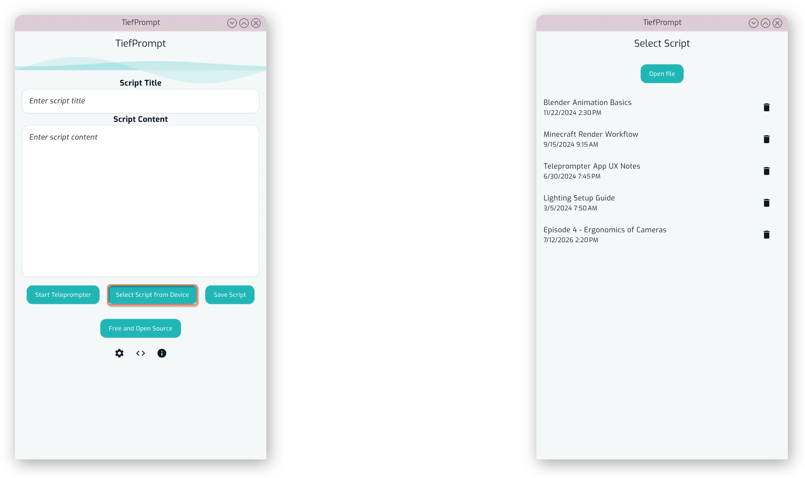
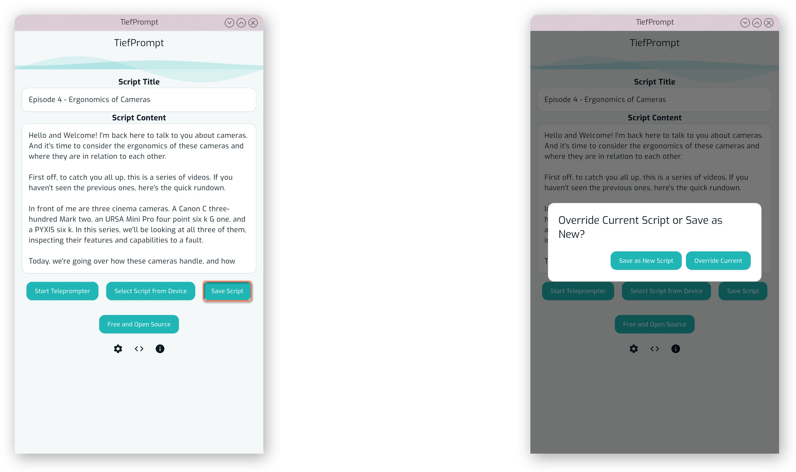
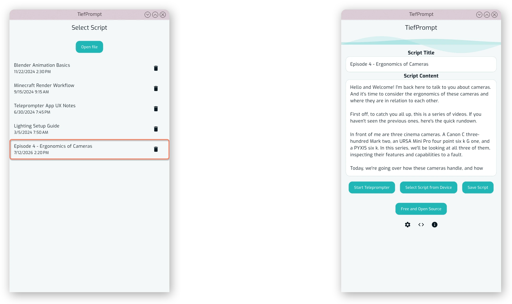
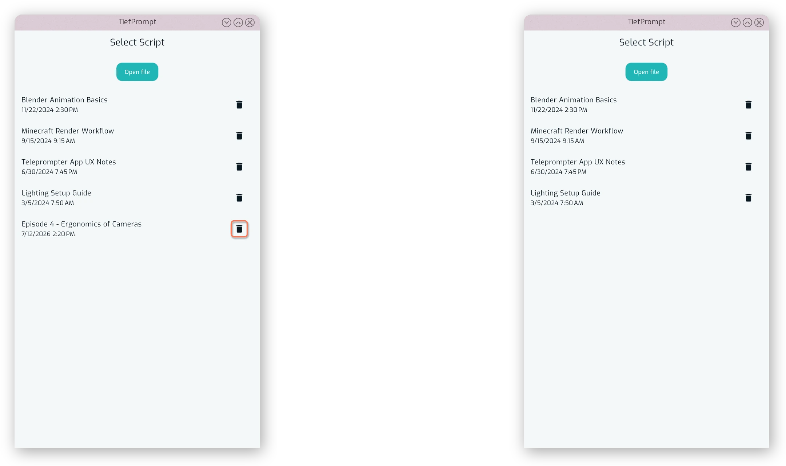
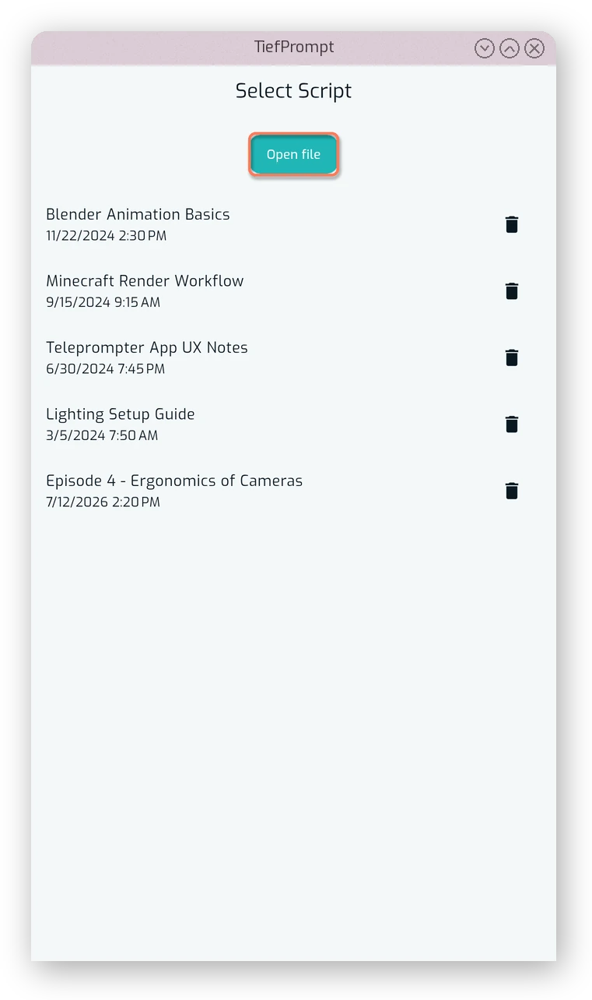

# Saved Scripts

{{ anchor: '02Usage/08SavedScripts.md' }}

Saving scripts is an obvious feature, until it isn't so obvious anymore.

TiefPrompt stores its scripts not in a file, but in the database of the app. This means that scripts are saved in the app's storage, and can be loaded and deleted from there. The Select Scripts screen is accessible from the home screen, and shows a list of all Select Scripts.

{.w-100}

Saving a script is done by pressing the "Save Script" button on the home screen. It saves the current text in the script content box with the current title in the title box. If you previously loaded a script in the session, you will be prompted to overwrite it, or save as a new script. If you did not load a script (i.e. are on the ephemeral script), it will be saved as a new script.

{.w-100}

Loading a script is done by pressing on it in the list of Select Scripts. The script content and title will be updated accordingly.

{.w-100}

When a script is no longer needed, it can be deleted by pressing the trashcan icon next to it in the list of Select Scripts. **There is no confirmation before deletion of a script.**

{.w-100}

The Select Scripts screen also includes a button up top to import a script from a file. You will be prompted by your operating system to select a file, and a new script entry will be created upon completion of the import, with the name of the file as the title. The creation date is the date of import.

{.w-50}

Persisting (saving) a script also persists the last scrolled position of the script. This means that when you load a script, it will be scrolled to the last position it was at when you last closed the prompter. This is useful for continuing a script from where you left off.

::: callout-info
There is currently no export feature for scripts, but it is planned for a future release. To export a script, you may copy the text from the script content box and paste it into a text file, which can then be saved to your device.
:::
